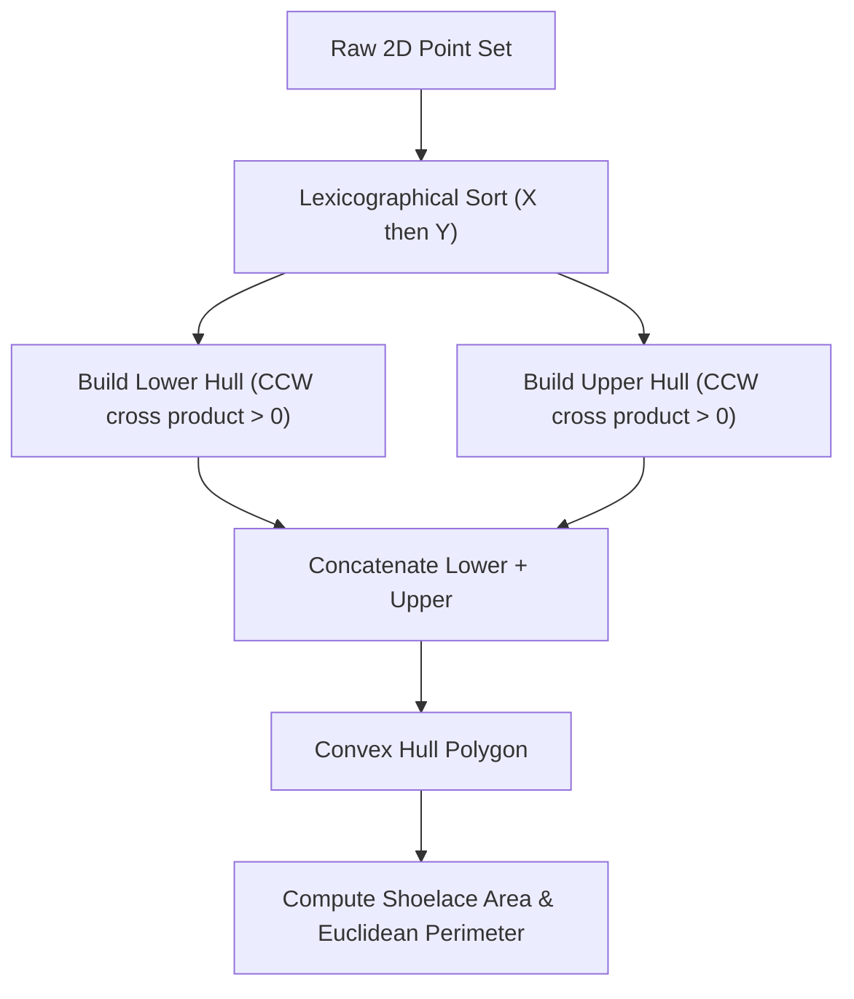

# genpark-convex-hull-andrew-monotone-chain-skill

Agent Skill implementing **Andrew's Monotone Chain 2D Convex Hull Algorithm** ($O(n \log n)$) with cross product orientation tests, collinear handling, and polygon geometry calculations.

## Architectural Overview

## Features
- **100% Python Standard Library**: Zero dependencies.
- **Strict $O(n \log n)$ Complexity**: Optimal sorting step followed by linear scan.
- **MCP Integration**: Compatible with Claude Desktop, Cursor, and Windsurf via JSON-RPC 2.0 stdio.
